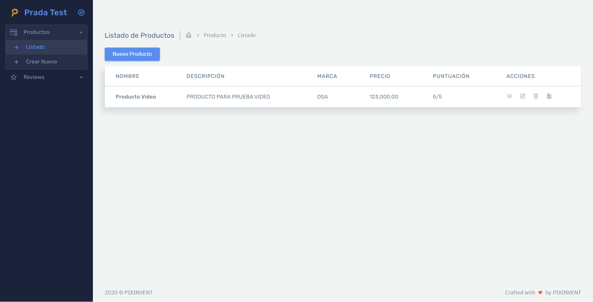
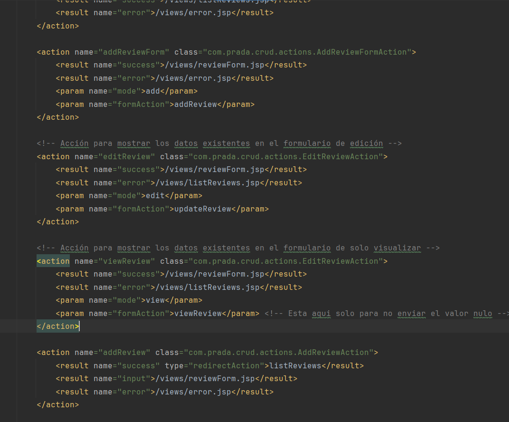
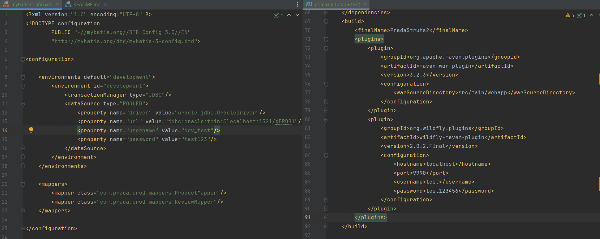
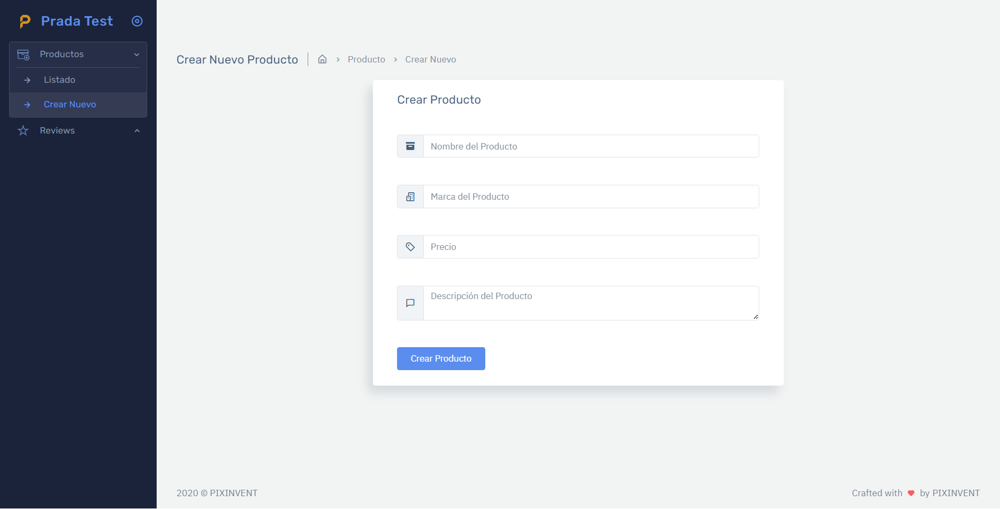
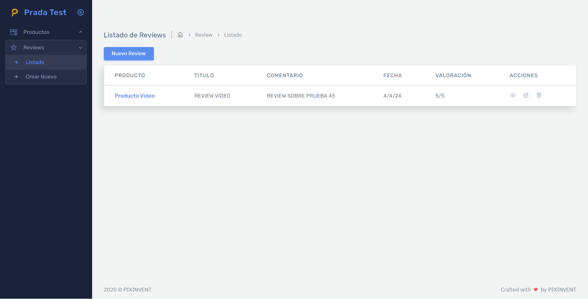
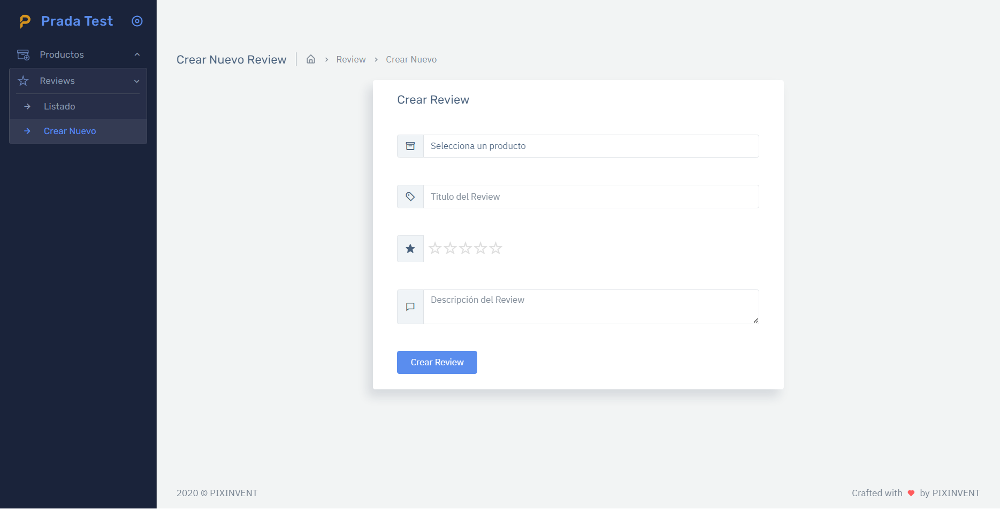
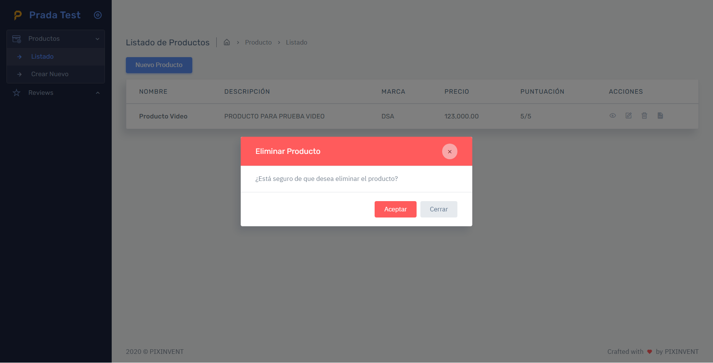
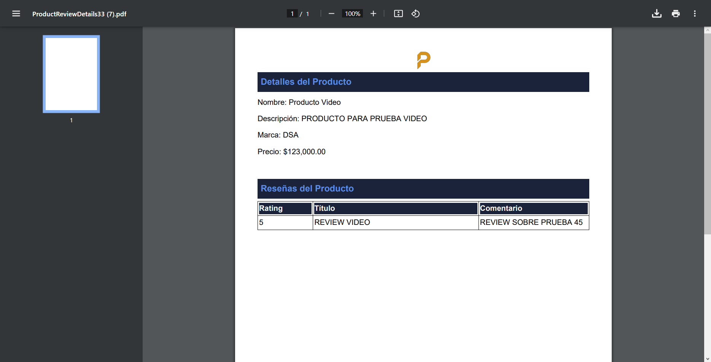

<br/>
<p align="center">
  <a href="#">
    
  </a>

<h3 align="center">Prueba Técnica DSA</h3>

<p align="center">
Luis Antonio de Jesús Prada Maldonado
    <br/>
    <br/>
    <a href="https://docs.google.com/document/d/1J2U5YTfK-TGy8g2VKhtpSE_jCbZgFDP6/edit?usp=sharing&ouid=117867636575453151061&rtpof=true&sd=true"><strong>Requerimiento</strong></a>
    <br/>

</p>

## Tabla de Contenido

* [Acerca del proyecto](#acerca-del-proyecto)
* [Stack utilizado](#stack-utilizado)
* [Estructura del proyecto](#estructura-del-proyecto)
* [Prerequisitos](#prerequisitos)
* [Instalacion](#instalacion)
* [Autor](#autor)
* [Tema utilizado](#tema-utilizado)
* [Screenshots](#screenshots)

## Acerca del proyecto



El proyecto es un CRUD para las entidades Producto y Reseña, con la funcionalidad adicional de generar un documento PDF con la información del producto y el detalle de sus reseñas asociadas.

## Stack utilizado

Java 11<br/>
Struts 2<br/>
MyBatis<br/>
Lombok<br/>
Oracle<br/>
Maven<br/>
Wildfly 16<br/>

## Estructura del Proyecto

* [Vistas]
  * Todas las vistas se encuentran en el directorio (webapp/views/)
  * El archivo struts.xml tiene toda la configuracion de la uso de las vistas con sus respectivas acciones.
  * Para los formularios de Product y Review, se creo una sola vista para cada uno productForm.jsp y reviewForm.jsp, respectivamente, esta es la misma vista que se utiliza para crear, visualizar y modificar la entidad. 
  * El comportamiento del formulario va a depender de los parametros <b>mode</b> y <b>formAction</b> de la action de struts.xml, como se observa en la imagen




* [Actions]
  * Todas actions que determinan el comportamiento de la aplicacion se encuentran en el directorio java/com/prada/crud/actions/.


* [DTOS]
  * En el directorio java/com/prada/crud/dtos/ se encuentran todos aquellos modelos adicionales cuya estructura difiere de la estructura de la tabla en la BD.


* [Mappers]
  * En el directorio java/com/prada/crud/mappers/ se encuentran los mappers de cada entidad, cada uno de estos debe estar registrado en el archivo de configuracion de MyBatis (mybatis-config.xml), estos mappers tienen todas las operaciones con la base de datos.


* [Models]
  * En el directorio java/com/prada/crud/models/ se encuentran los modelos de cada entidad, se utilizan las anotaciones de Lombok para facilitar la generacion de cada uno y delegar la creacion de setters y getters a la herramienta.


* [Services]
  * En el directorio java/com/prada/crud/services/ se encuentran los servicios de cada entidad, esto se hizo para mantener la interaccion con la base de datos fuera de los actions y hacer mas modular el codigo.
  * Todas las operaciones que requieren interaccion con la base de datos usan el servicio y queda separada entonces la logica de cada una de las capas.


* [Utils]
  * En el directorio java/com/prada/crud/utils/ tenemos:
    * MyBatisUtil el cual genera nuestra SqlFactory o nuestro pool de conexion a la bd, el mismo lee la configuracion del mybatis-config.xml.
    * PdfReportGenerator la clase que utilizamos para generar el pdf que debe ser descargado.

## Prerequisitos

Tener instalado una version de Wildfly compatible con la versión de Struts2 (6.1.2.2) utilizada, en este caso se utilizo WildFly 16, además del JDK 11 de Java y un servidor de base de datos Oracle. 

### Instalacion

1. Descargar el proyecto desde el repositorio GIT

```sh
git clone https://github.com/prada-escobar/prada-dsa-test.git
```

2. Crear la base de datos y sus tablas (el script de las tablas esta en la raiz del proyecto DEV_TEST.sql)


3. Configurar los archivos mybatis-config.xml y pom.xml con las credenciales que correspondan a su ambiente.




4. Desde el directorio del proyecto ejecutar el siguiente comando para instalar las dependencias Maven del proyecto

```sh
mvn clean install
```


5. Generar el artefacto y desplegarlo en el servidor Wildfly correspondiente y Listo!

## Autor

* **Luis Antonio de Jesús Prada Maldonado**

## Tema utilizado

* [Frest](https://demos.pixinvent.com/frest-html-admin-template/html/vertical-menu-template-semi-dark/app-ecommerce-dashboard.html)

## Screenshots










